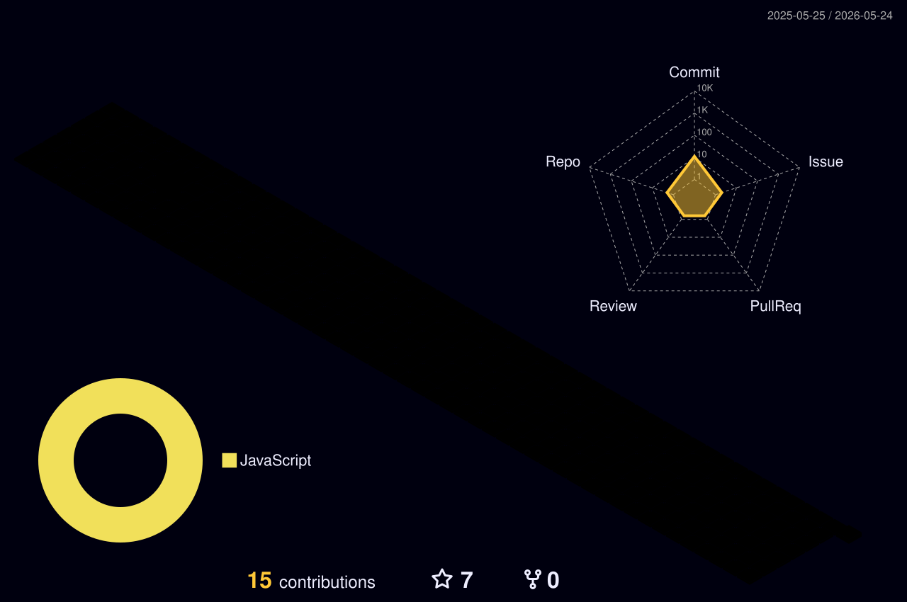

<!-- ═══════════════════════════════════════════════════════ -->
<!-- HEADER — Cinematic venom banner                        -->
<!-- ═══════════════════════════════════════════════════════ -->

<!-- ═══════════════════════════════════════════════════════ -->
<!-- TYPING INTRO                                             -->
<!-- ═══════════════════════════════════════════════════════ -->

 

<!-- ═══════════════════════════════════════════════════════ -->
<!-- SOCIAL / CONTACT BADGES                                  -->
<!-- ═══════════════════════════════════════════════════════ -->

<!-- ═══════════════════════════════════════════════════════ -->
<!-- WHAT I BUILD — Specialty cards                           -->
<!-- ═══════════════════════════════════════════════════════ -->

<h3 align="center">⚡ What I Build</h3>

<table align="center">
<tr>
<td width="25%" align="center">
<b>🤖 AI Automation</b> 
Intelligent agents, LLM pipelines & workflow orchestration that replace manual ops
</td>
<td width="25%" align="center">
<b>🌐 SaaS Platforms</b> 
Production-grade products — auth, billing, dashboards, multi-tenant architecture
</td>
<td width="25%" align="center">
<b>⚡ n8n Workflows</b> 
Event-driven automations connecting APIs, CRMs, and AI models at scale
</td>
<td width="25%" align="center">
<b>🧠 LLM Integration</b> 
RAG, voice AI, computer vision & real-time inference in production systems
</td>
</tr>
</table>

 

<!-- ═══════════════════════════════════════════════════════ -->
<!-- TECH STACK — Skill icons                                 -->
<!-- ═══════════════════════════════════════════════════════ -->

<h3 align="center">🛠 Tech Stack</h3>

<b>Languages</b>

<b>Frameworks & Libraries</b>

<b>Infrastructure & Data</b>

<b>Tools & Platforms</b>

 

<!-- ═══════════════════════════════════════════════════════ -->
<!-- GITHUB STATS — Triptych                                  -->
<!-- ═══════════════════════════════════════════════════════ -->

<h3 align="center">📊 GitHub Analytics</h3>

<table align="center">
<tr>
<td width="33%" align="center">

</td>
<td width="33%" align="center">

</td>
<td width="33%" align="center">

</td>
</tr>
</table>

 

<!-- ═══════════════════════════════════════════════════════ -->
<!-- ACTIVITY GRAPH                                           -->
<!-- ═══════════════════════════════════════════════════════ -->

<h3 align="center">📈 Contribution Activity</h3>

 

<!-- ═══════════════════════════════════════════════════════ -->
<!-- 3D CONTRIBUTION CALENDAR                                 -->
<!-- ═══════════════════════════════════════════════════════ -->

<h3 align="center">🌌 3D Contribution Landscape</h3>

 

<!-- ═══════════════════════════════════════════════════════ -->
<!-- SNAKE ANIMATION                                          -->
<!-- ═══════════════════════════════════════════════════════ -->

<h3 align="center">🐍 // my contributions, consumed</h3>

<picture>
  <source media="(prefers-color-scheme: dark)" srcset="./dist/github-snake-dark.svg" />
  <source media="(prefers-color-scheme: light)" srcset="./dist/github-snake.svg" />
  
</picture>

 

<!-- ═══════════════════════════════════════════════════════ -->
<!-- TROPHY SHELF                                             -->
<!-- ═══════════════════════════════════════════════════════ -->

<h3 align="center">🏆 Trophies</h3>

 

<!-- ═══════════════════════════════════════════════════════ -->
<!-- FEATURED PROJECTS                                        -->
<!-- ═══════════════════════════════════════════════════════ -->

<h3 align="center">🚀 Featured Work</h3>

<table align="center">
<tr>
<td width="50%" valign="top">

**🌐 [Praivox](https://praivox.com)** — *Founder & Lead Engineer*

Elite software development agency architecting AI-powered SaaS, automation pipelines, and production systems for ambitious companies.

 

 

</td>
<td width="50%" valign="top">

**📞 AI-Dailer** — *AI-Powered All-in-One Dialer*

Production voice AI platform combining real-time telephony, LLM orchestration, and automated outreach workflows.

 

 

</td>
</tr>
<tr>
<td width="50%" valign="top">

**🏟 AlphaVenueAI** — *AI Venue Management*

Full-stack AI platform for venue operations — intelligent scheduling, analytics, and automation at scale.

 

 

</td>
<td width="50%" valign="top">

**🧠 [Face Recognition Project](https://github.com/umer-jahangier/Face-Recognition-Project)** — *CNN Attendance System*

Digital Image Processing project integrating Convolutional Neural Networks for real-time face recognition attendance tracking.

 

 

</td>
</tr>
</table>

 

<!-- ═══════════════════════════════════════════════════════ -->
<!-- FOOTER                                                   -->
<!-- ═══════════════════════════════════════════════════════ -->

<code>// built with intent · powered by automation · engineered at Praivox</code>

  

⭐ If my work helped you, consider starring a repo — it fuels the next build.

  

