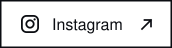
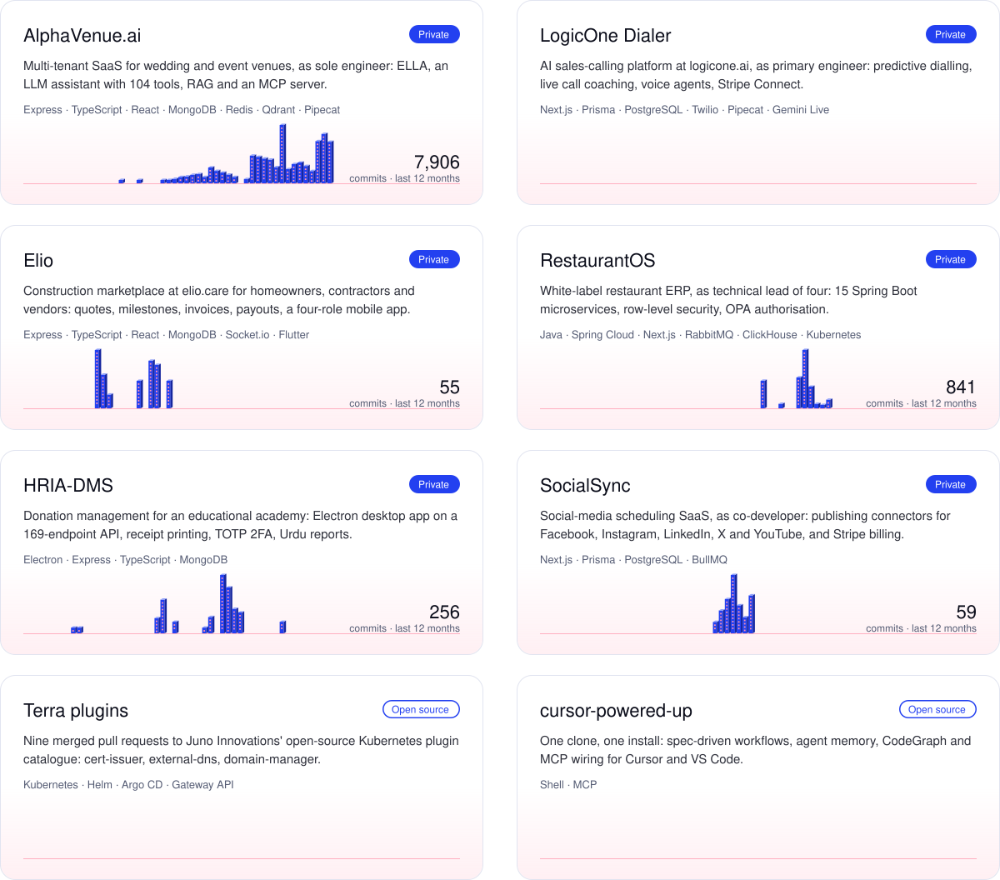

<!-- Generated from variants/README.personal.md by .github/workflows/profile.yml. Edit the variant, not this file. -->

<picture>
  <source media="(max-width: 600px)" srcset="dist/cover-personal-mobile.svg">
  <source media="(prefers-color-scheme: dark)" srcset="dist/cover-personal-dark.svg">
  
</picture>

<a href="mailto:umer.jahangier@gmail.com"><picture><source media="(prefers-color-scheme: dark)" srcset="dist/btn-email-dark.svg"></picture></a>&nbsp;<a href="https://www.linkedin.com/in/muhammad-umer-jahangier/"><picture><source media="(prefers-color-scheme: dark)" srcset="dist/btn-linkedin-dark.svg"></picture></a>&nbsp;<a href="https://instagram.com/umer_jahangier"><picture><source media="(prefers-color-scheme: dark)" srcset="dist/btn-instagram-dark.svg"></picture></a>

I build AI agents, automations and the full-stack products around them, from the first schema to the production deploy. Almost all of it ships in private repositories, for clients and for products I own, so every chart here counts private work.

<picture>
  <source media="(max-width: 600px)" srcset="dist/rhythm-mobile.svg">
  <source media="(prefers-color-scheme: dark)" srcset="dist/rhythm-dark.svg">
  
</picture>

<picture>
  <source media="(max-width: 600px)" srcset="dist/activity-mobile.svg">
  <source media="(prefers-color-scheme: dark)" srcset="dist/activity-dark.svg">
  
</picture>

### Selected work

<picture>
  <source media="(max-width: 600px)" srcset="dist/work-mobile.svg">
  <source media="(prefers-color-scheme: dark)" srcset="dist/work-dark.svg">
  
</picture>

Open source: [**cursor-powered-up**](https://github.com/umer-jahangier/cursor-powered-up) · [**domain-manager**](https://github.com/umer-jahangier/domain-manager) (Kubernetes DNS and certificate status) · [**Face Recognition**](https://github.com/umer-jahangier/Face-Recognition-Project) (CNN attendance, TensorFlow). Also: **madaddGar** (on-demand home services) · **Qalb-e-Saleem** (Flutter audio and reading app). Every chart is rebuilt daily from the GitHub API; private work is counted as totals only, and no code leaves the repositories.

### Toolbox

**Languages** · TypeScript · Python · JavaScript · Dart · Java · C++ · SQL 
**Frontend** · Next.js · React · React Native / Expo · Flutter · Tailwind CSS · GSAP 
**Backend** · Node.js · Express · Spring · FastAPI · Prisma · REST · GraphQL · Socket.io 
**AI and automation** · LLM agents · RAG · voice agents (Retell, Twilio) · n8n · LangChain · OpenAI · Claude · computer vision 
**Data and infrastructure** · PostgreSQL · MongoDB · Redis · Docker · Kubernetes · Electron · GitHub Actions · Vercel · Linux

 

<picture>
  <source media="(prefers-color-scheme: dark)" srcset="dist/github-snake-dark.svg">
  
</picture>

Have something to build, or a role to talk about? Email **[umer.jahangier@gmail.com](mailto:umer.jahangier@gmail.com)** or [connect on LinkedIn](https://www.linkedin.com/in/muhammad-umer-jahangier/).
